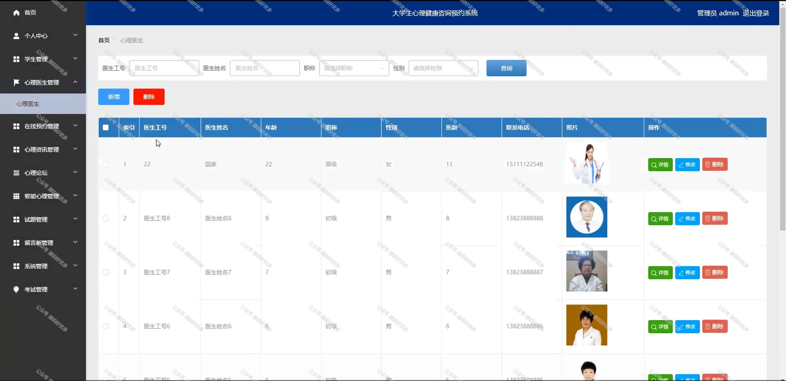

 
## 查看主页获取源码

> **作者介绍**： **✌**全网粉丝10W+本平台特邀作者、博客专家、CSDN新星计划导师、java领域优质创作者,博客之星、掘金/华为云/阿里云/InfoQ等平台优质作者、专注于项目实战 **✌**

  

### 一、作品包含

源码+数据库+全套环境和工具资源+部署教程

### 二、项目技术

前端技术：Html、Css、Js、Vue、Element-ui

数据库：MySQL

后端技术：Java、Spring Boot、MyBatis

  

### 三、运行环境

开发工具：IDEA/eclipse

数据库：MySQL5.7

数据库管理工具：Navicat10以上版本

环境配置软件： JDK1.8+Maven3.6.3

前端Nodejs：14

### 四、项目介绍
项目编号：springbootA141

大学生心理健康咨询预约系统旨在为高校学生提供一个便捷、专业的心理健康服务平台。在这个快节奏、压力日益增大的社会环境下，大学生面临着学业、就业、人际关系等多重压力，心理健康问题日益凸显。该系统通过线上预约、信息保密等功能，帮助学生及时解决心理困扰，提升心理素质，促进其全面发展。

前台学生功能：登录注册、首页、心理医生、心理咨询、心理论坛、智能心理、公告信息、留言板、后台管理和个人中心。

后台分为管理员、学生、心理医生
管理员的功能：首页、个人中心、学生管理、心理医生管理、在线预约管理、心理咨询管理、心理论坛、智能心理管理、试题管理、留言板管理、系统管理、考试管理。
学生的功能：首页、个人中心、在线预约管理。
心理医生的功能：首页、个人中心、在线预约管理、试题管理、智能心理管理和考试管理。

### 五、运行截图

  

